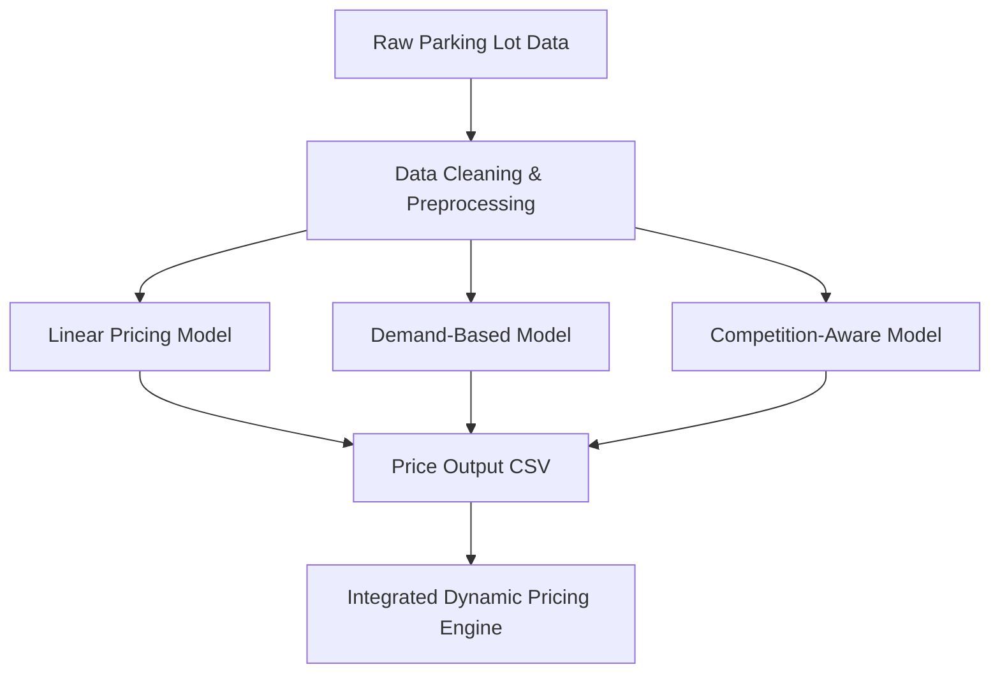

# Dynamic Pricing for Urban Parking Lots

## Overview
This project was developed as part of **Summer Analytics 2025**, organized by the Consulting & Analytics Club in collaboration with **Pathway**. The goal was to build a real-time, intelligent pricing engine for urban parking lots that dynamically adjusts rates based on demand, competition, and other relevant factors.

---

##  Tech Stack
- **Python** — for data processing and modeling
- **Pandas / NumPy** — for data manipulation and preprocessing
- **Matplotlib / Seaborn** — for visualization
- **Scikit-learn** — for standard machine learning support
- **Geopy** — for spatial calculations (competition-based pricing)
- **Jupyter Notebook** — for development and presentation

---

##  Architecture Diagram (Mermaid)


---

##  Workflow & Architecture Explanation

### 1. **Data Ingestion**
- Raw data for 73 days, across 14 parking lots, with 30-minute intervals.

### 2. **Preprocessing**
- Removal of corrupted rows (e.g., non-numeric values in Latitude column)
- Conversion of data types for correct distance calculations
- NaN removal and integrity checks

### 3. **Model Development**
- **Model 1: Linear Pricing** — Basic price increase with occupancy
- **Model 2: Demand-Based Pricing** — Uses a weighted function of queue, traffic, and vehicle types
- **Model 3: Competition-Aware Pricing** — Adjusts price based on nearby parking lots using geospatial distance

### 4. **Output Generation**
- CSV output with all three pricing model results per timestamp per lot
- Can be connected to downstream routing systems or a web-based visualization engine

---

##  Repository Structure
```bash
├── data/                    # Input dataset files
├── notebooks/               # Jupyter notebook (.ipynb) implementation
├── output/                  # final_pricing_output.csv (optional)
├── report/                  # Final report in PDF
├── README.md                # Project documentation (this file)
```

---

## Assumptions & Considerations
- Base price assumed = $10 for all lots
- Demand parameters are weighted based on intuition + preliminary exploration
- Nearby competitors = lots within a 0.5 km radius (using Haversine distance)
- Traffic: "average" interpreted as "medium"

---

##  Future Enhancements
- Integration with real-time traffic APIs (e.g., Google Maps API)
- Reinforcement learning models to self-adjust weights
- Dashboards for lot managers and visual route guidance

---

##  License
This repository is for academic and demonstration purposes as part of the Summer Analytics 2025 Capstone Challenge.

---

##  Author
Developed by: *[Vaishnavi Choudhary]*
